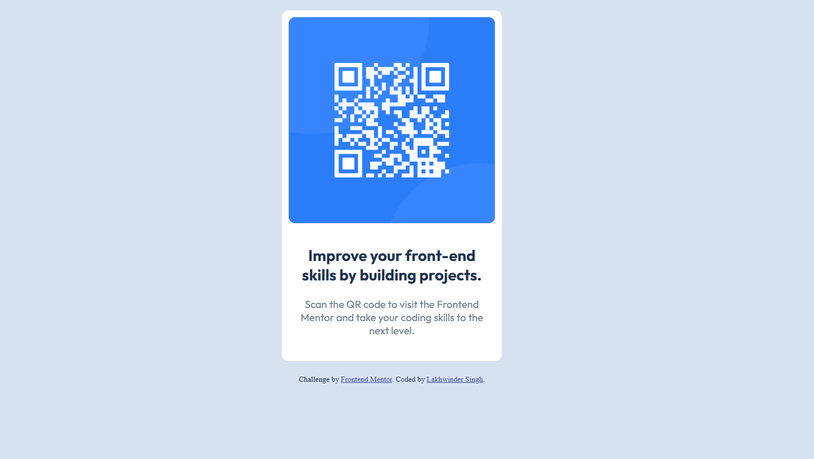

# Frontend Mentor - QR code component solution

This is a solution to the [QR code component challenge on Frontend Mentor](https://www.frontendmentor.io/challenges/qr-code-component-iux_sIO_H). Frontend Mentor challenges help you improve your coding skills by building realistic projects. 

## Table of contents

- [Overview](#overview)
  - [Screenshot](#screenshot)
  - [Links](#links)
- [My process](#my-process)
  - [Built with](#built-with)
  - [What I learned](#what-i-learned)
- [Author](#author)


## Overview

### Screenshot



### Links

- Solution URL: [Add solution URL here](https://your-solution-url.com)
- Live Site URL: [Add live site URL here](https://your-live-site-url.com)

## My process
- First Node -> Card 
- Second level nodes -> image and the text
- Third level nodes -> text -> h1 and p elements
### Built with

- Semantic HTML5 markup
- CSS custom properties
- Mobile-first workflow


### What I learned

- How to use :root{} inside the CSS to define global variables and using var(--someVariableName) function to access variable in the CSS.
- [Visit this to check more about variables in CSS](https://www.w3schools.com/css/css3_variables.asp)

```css
:root {
        --slate300: hsl(212, 45%, 89%);
        --slate500: hsl(216, 15%, 48%);
        --slate900: hsl(218, 44%, 22%);
        --round10: 10px;
      }
        .slate300{
        color: var(--slate300);
      }
```


## Author

- Website - [Lakhwinder Singh](https://lakhwinder.netlify.app)
- Frontend Mentor - [Lakhwinderr](https://www.frontendmentor.io/profile/Lakhwinderr)


